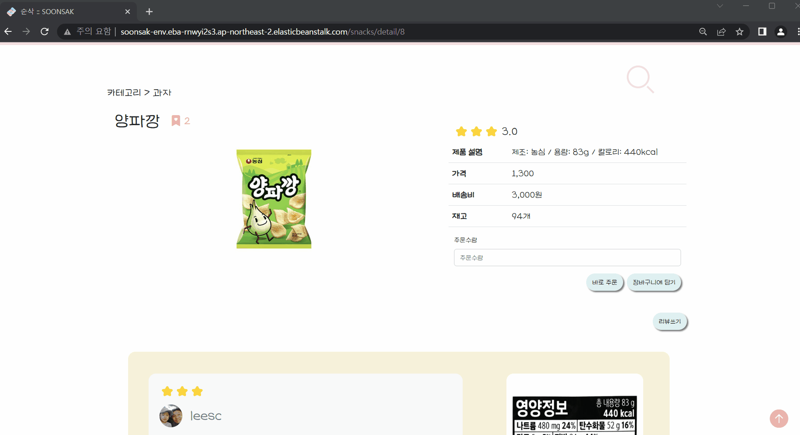

# 🗂️ Semi Project Ⅱ

> 서비스 이름 : 순삭(SOONSAK)
>
> 제작 기간 : 2022-11-09 ~ 2022-11-21
>
> 팀 구성 : 16팀 SOONSAK (이동영, 이순철, 강문주, 박상준, 한가을, 이수경)
>
> 🌐 Link : http://soonsak-env.eba-rnwyi2s3.ap-northeast-2.elasticbeanstalk.com/


## 🏆 award

20팀 중 공동 4등 - 아차상


## 🫧 Preview

- 메인 화면


- 로그인


- 프로필 화면


- 찜 목록


- 상품 상세 화면


- 주문




## 📈 purpose

1. `Django` / `HTML` / `CSS` / `Javascript`을 이용해 `국내 과자`, `해외 과자`, `수제 과자`를 구매하고 리뷰를 작성할 수 있는 웹 페이지를 구현
2. 일반 사용자와 관리자를 구분하여 사용할 수 있는 기능을 분리함
3. 실제로 결제할 수 있도록 결제 플랫폼 구현


## ⚙️ Stacks

         


## 📍 Description

1.   관리자 계정으로 로그인시 모든 주문건을 관리할 수 있게 함

   - `orders/templates/orders/order_list.html`에서 모든 주문 내역 조회 가능


   ```html
   <div class="row d-flex justify-content-center align-items-center py-5">
       <div class="d-flex flex-column justify-content-center align-items-center shadow p-5 rounded-5">
         <div class="bg-tape">
           <h1 class="d-flex justify-content-center">주문내역</h1>
         </div>
         
   			<!-- 주문내역 관리 버튼 -->
         <div class="container d-flex flex-column bg-white rounded-5 my-5">
           <div class="menu navbar-nav d-flex flex-row justify-content-center py-4">
             <li>
               <a type="button" id="complete_orders" class="pe-2 text-black">
                 <h5><i class="bi bi-credit-card"></i>결제완료</h5>
               </a>
             </li>/
             <li>
               <a type="button" id="delivery_orders" class="pe-2 text-black">
                 <h5><i class="bi bi-truck"></i>배송관리</h5>
               </a>
             </li>/
             <li>
               <a type="button" id="cancel_orders" class="text-black">
                 <h5><i class="bi bi-x-circle"></i>취소주문</h5>
               </a>
             </li>
           </div>
   
           <!-- 결제 완료 내역 -->
           <div id="completeOrders" style="display: none;">
             <div class="d-flex flex-column text-center mb-3">
               <h4 class="fw-bold">결제완료</h4>
               <table class="table text-center">
                 <thead>
                   <tr>
                     <th scope="col">No.</th>
                     <th scope="col">주문자</th>
                     <th scope="col">상품</th>
                     <th scope="col">수량</th>
                     <th scope="col">주문금액(배송비 미포함)</th>
                     <th scope="col">배송지</th>
                     <th scope="col">연락처</th>
                     <th scope="col">주문 상태</th>
                     <th scope="col">주문 날짜</th>
                     <th scope="col">배송 상태 변경</th>
                   </tr>
                 </thead>
                 <tbody>
                   
                     <tr>
                       <td>{{ order.id }}</td>
                       <td>{{ order.user }}</td>
                       <td>{{ order.snack }}</td>
                       <td>{{ order.quantity }}</td>
                       <td>{{ order.total|intcomma }}원</td>
                       <td>{{ order.shipping_address }}</td>
                       <td>{{ order.contact_number }}</td>
                       <td>{{ order.order_status }}</td>
                       <td>{{ order.register_data }}</td>
                       <td class="d-grid gap-3 d-md-flex justify-content-center">
                         <a href="" class="btn btn2" style="height: 27px;padding: 1px;width: 80px;">주문취소</a>
                         <a href="" class="btn" style="height: 27px;padding: 1px;width: 80px;">배송 준비중</a>
                       </td>
                     </tr>
                   
                 </tbody>
               </table>
             </div>
           </div>
   ```

   > `배송 준비중` / `배송 완료` / `주문 취소` 내역도 `결제 완료` 내역과 동일하게 코드 구성

   - `orders/views.py`에 함수 추가

   ```python
   # 배송 상태 변경
   def delivery(request, order_pk):
       order = Order.objects.get(pk=order_pk)
       order.register_data = timezone.now()
       order.order_status = "배송 준비중"
       order.save()
       return redirect("orders:order_list")
   
   # 배송 완료
   def delivery_complete(request, order_pk):
       order = Order.objects.get(pk=order_pk)
       order.register_data = timezone.now()
       order.order_status = "배송완료"
       order.save()
       return redirect("orders:order_list")
     
   # 관리자 주문 내역
   def order_list(request):
       # 결제 완료된 주문들
       complete_orders = Order.objects.filter(order_status="결제완료").order_by("-register_data")
       # 취소된 주문들
       cancel_orders = Order.objects.filter(order_status="취소주문").order_by("-register_data")
       # 배송 준비중인 주문들
       delivery_orders = Order.objects.filter(order_status="배송 준비중").order_by("-register_data")
       # 배송 완료된 주문들
       delivery_complete_orders = Order.objects.filter(order_status="배송완료").order_by("-register_data")
       context = {
           "complete_orders": complete_orders,
           "cancel_orders": cancel_orders,
           "delivery_orders": delivery_orders,
           "delivery_complete_orders": delivery_complete_orders,
       }
       return render(request, "orders/order_list.html", context)
   ```

   - `orders/urls.py` 추가

   ```python
   # 관리자 주문 내역
   path('order_list/', views.order_list, name='order_list'),
   # 배송 준비중
   path('delivery/<int:order_pk>/', views.delivery, name='delivery'),
   # 배송 완료
   path('delivery_complete/<int:order_pk>/', views.delivery_complete, name='delivery_complete')
   ```

   - `accounts/templates/accounts/detail.html`에 url 추가

   ```html
   <!-- 관리자가 관리자 프로필 접속했을때만 보이는 카테고리/제품등록 버튼 -->
   <div class="mt-3">
   	
   		<!-- 카테고리 등록 -->
   		<a href="" class="btn rounded-pill me-2" type="submit">카테고리 등록</a>
       <!-- 제품등록 -->
       <a href="" class="btn rounded-pill me-2" type="submit">제품 등록</a>
       <!-- 주문내역 관리 -->
       <a href="" class="btn rounded-pill">주문내역 관리</a>
     
   </div>
   ```

2. 회원가입 및 회원정보 수정시 `카카오 우편번호 서비스`를 이용해 검색 기능 추가

3. - `accounts/templates/accounts/signup.html`

   ```html
   <div>
   	<input type="text" id="sample6_postcode" placeholder="우편번호" name="postcode">
     <input class="btn rounded-pill" type="button" onclick="sample6_execDaumPostcode()" value="우편번호 찾기"><br>
     <input type="text" id="sample6_address" placeholder="주소" name="address"><br>
     <input type="text" id="sample6_detailAddress" placeholder="상세주소" name="detailAddress">
     <input type="text" id="sample6_extraAddress" name="extraAddress">
   </div>
   ```

   > `signup.html` 파일 ` ~ ` 안에 `script` 코드 추가 작성

   - `accounts/views.py` 에 코드 추가

   ```python
   # 회원가입
   def signup(request):
       if request.method == 'POST':
           form = CustomUserCreationForm(request.POST, request.FILES)
           if form.is_valid():
               user = form.save(commit=False)
               user.address = request.POST.get('postcode') + request.POST.get('address') + request.POST.get('detailAddress') + request.POST.get('extraAddress')
               user.save()
   ...
       else:
           form = CustomUserCreationForm()
       context = {
           'form':form
       }
       return render(request, 'accounts/signup.html', context)
     
   # 회원 프로필 수정
   def update(request, user_pk):
   ...
               user.address = request.POST.get('postcode') + request.POST.get('address') + request.POST.get('detailAddress') + request.POST.get('extraAddress')
   ...
       return render(request, 'accounts/update.html', context)
   ```

3. 소셜(`카카오`) 로그인 연동 구현

   - `accounts/view.py`에 함수 추가

   ```python
   # 카카오 로그인
   def kakao_request(request):
       kakao_api = "https://kauth.kakao.com/oauth/authorize?response_type=code"
       redirect_uri = "http://soonsak-env.eba-rnwyi2s3.ap-northeast-2.elasticbeanstalk.com/accounts/login/kakao/callback"
       client_id = "e354ba53e1c46a96b9483564296d7ca9"  # 배포시 보안적용 해야함
       return redirect(f"{kakao_api}&client_id={client_id}&redirect_uri={redirect_uri}")
   
   
   def kakao_callback(request):
       data = {
           "grant_type": "authorization_code",
           "client_id": "e354ba53e1c46a96b9483564296d7ca9",  # 배포시 보안적용 해야함
           "redirect_uri": "http://soonsak-env.eba-rnwyi2s3.ap-northeast-2.elasticbeanstalk.com/accounts/login/kakao/callback",
           "code": request.GET.get("code"),
       }
       kakao_token_api = "https://kauth.kakao.com/oauth/token"
       access_token = requests.post(kakao_token_api, data=data).json()["access_token"]
   
       headers = {"Authorization": f"bearer ${access_token}"}
       kakao_user_api = "https://kapi.kakao.com/v2/user/me"
       kakao_user_information = requests.get(kakao_user_api, headers=headers).json()
   
       kakao_id = kakao_user_information["id"]
       kakao_nickname = kakao_user_information["properties"]["nickname"]
       # 유저 모델에 프로필 사진 추가시 사용
       kakao_profile_image = kakao_user_information["properties"]["profile_image"]
   
       if get_user_model().objects.filter(kakao_id=kakao_id).exists():
           kakao_user = get_user_model().objects.get(kakao_id=kakao_id)
       else:
           kakao_login_user = get_user_model()()
           kakao_login_user.username = kakao_nickname
           kakao_login_user.kakao_id = kakao_id
           kakao_login_user.social_profile_picture = kakao_profile_image
           kakao_login_user.set_password(str(state_token))
           kakao_login_user.save()
           kakao_user = get_user_model().objects.get(kakao_id=kakao_id)
       user_login(request, kakao_user, "django.contrib.auth.backends.ModelBackend")
       return redirect(request.GET.get("next") or "/")
   ```

   - `accounts/urls.py`

   ```python
   # 카카오 로그인
   path("login/kakao/", views.kakao_request, name="kakao"),
   path("login/kakao/callback/", views.kakao_callback),
   ```

   - `accounts/login.html`에 로그인 url 추가

   ```html
   <div class="mt-4">
   	<h4 class="d-flex justify-content-center">간편 로그인</h4>
   	<div class="d-flex flex-column text-center mt-3">
       <a href="kakao" class="mb-2">
       	
       </a>
     </div>
   </div>
   ```

   


## 🔥 Issues

<details>
  <summary>makemigrations Pilkit 오류</summary>
  <div markdown="1">
    <br>❌ 에러 사항<br>‘ImportError: PILKit was unable to import the Python Imaging Library. Please confirm it`s installed and available on your current Python path.’<br><br>
  </div>
  <div>
   💡 해결방법<br>
    1. pip list 해보고 pillow, image 가 설치 되어있는지 확인한다.<br>
		2. 없다면 터미널에 sudo pip install pillow image<br>
		3. 설치되어 있다면  pip uninstall Pillow, pip uninstall Image<br>
		4. 다시 pip install Pillow, pip install Image<br>
		5. pip uninstall Image 안되는 경우 pip install Pillow 한다.<br>
		6. 다시 makemigrations
  </div>
</details>

<details>
  <summary>'AnonymousUser' object has no attribute '_meta'</summary>
  <div markdown="1">
    <br>❌ 에러 사항<br>
    회원가입 기능 구현 후 자동 로그인 기능을 추가했음
		회원가입이 완료된 다음 **['AnonymousUser' object has no attribute '_meta'](https://stackoverflow.com/questions/46284664/django-anonymoususer-object-has-no-attribute-meta) 오류 발생**<br><br>
  </div>
  <div markdown="1"> 
    💡 해결 방법<br>
    1. py [manage.py](http://manage.py) makemigrations<br>
		2. py [manage.py](http://manage.py) migrate
  </div>
</details>
<details>
  <summary>Merge conflict</summary>
  <div markdown="1">
    <br>❌ 에러 사항<br>
    같은 파일을 동시에 작업하고 push 과정에서 오류 발생<br><br>
  </div>
  <div markdown="1"> 
    💡 해결 방법<br>
    1. 새로 clone을 받고 작업<br>
		2. merge conflict 발생한 부분을 수정
  </div>
</details>


## 🫧 Contributors

<a href="https://github.com/han-gaeul/SOONSAK/graphs/contributors">
  </a>
