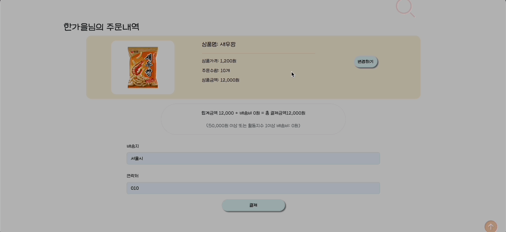

# 🗂️ Semi Project Ⅱ

> 서비스 이름 : 순삭(SOONSAK)
>
> 제작 기간 : 2022-11-09 ~ 2022-11-21
>
> 팀 구성 : 16팀 SOONSAK (이동영, 이순철, 강문주, 박상준, 한가을, 이수경)
>
> 🌐 Link : http://soonsak-env.eba-rnwyi2s3.ap-northeast-2.elasticbeanstalk.com/

## 🏆 award

20팀 중 공동 4등 - 아차상

## 🫧 Preview

## 🫧 Contributors

## ⚙️ Stacks

       

## 🔥 Issues

  
makemigrations Pilkit 오류

  

     ❌ 에러 사항 ‘ImportError: PILKit was unable to import the Python Imaging Library. Please confirm it`s installed and available on your current Python path.’  
  

  

   💡 해결방법 
    1. pip list 해보고 pillow, image 가 설치 되어있는지 확인한다. 
		2. 없다면 터미널에 sudo pip install pillow image 
		3. 설치되어 있다면  pip uninstall Pillow, pip uninstall Image 
		4. 다시 pip install Pillow, pip install Image 
		5. pip uninstall Image 안되는 경우 pip install Pillow 한다. 
		6. 다시 makemigrations
  

  
'AnonymousUser' object has no attribute '_meta'

  

     ❌ 에러 사항 
    회원가입 기능 구현 후 자동 로그인 기능을 추가했음
		회원가입이 완료된 다음 **['AnonymousUser' object has no attribute '_meta'](https://stackoverflow.com/questions/46284664/django-anonymoususer-object-has-no-attribute-meta) 오류 발생**  
  

  
 
    💡 해결 방법 
    1. py [manage.py](http://manage.py) makemigrations 
		2. py [manage.py](http://manage.py) migrate
  

